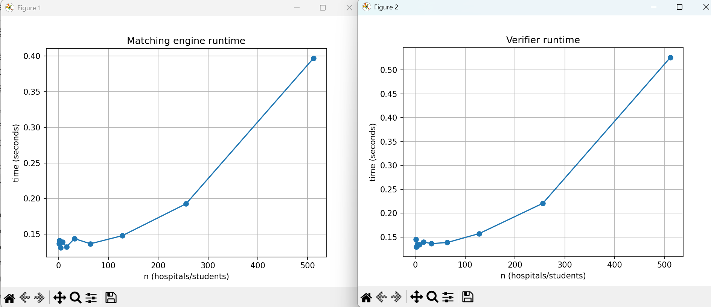

# Gale-Shapley-Algorithm
Implemented by Aarush Tripathi (86149341) and Alisia Nguyen (1968644)

Implementation of the Gale Shapley Algorithm dealing with hospitals and students with validity and scalability tests.

# Compiling and Running
Ensure to install matplotlib by running:
pip install matplotlib

Running the Matching Algorithm:
python matching.py

Running the Verifier:
python verifier.py

Running Scabaility:
python scability.py

# Assumptions
Input Format:
- The input files must follow the exact format specified:
    First line: a single integer 'n' which represents the number of hospitals and students
    Next n lines: hospital preference lists
    Next n lines: student preference lists
- No extra blank lines or whitespace at the end of the file 
- Hospitals and students are numbered starting from 1
- Each list must be complete with numbers from 1 to n with no duplicates or missing values

Output Format:
- hospital_id student_id (space separated)
- Each line represents one match

Dependencies:
- External Libraries:
    matplotlib
    imports(random, time, sys, subprocess)

Matching Algorithm Assumptions:
- Matching algorithm uses hospital proposing version of Gale-Shapley
- Each hospital is matched to exactly one student
- Runs input file and prints to output file

Verifer Assumptions:
- Uses both input and output file to test 
- Checks both validity (proper matching) and stability (no unstable pairing)
- A match is considered invalid if
    Wrong number of matches
    A hospital or student is unmatched
    A student is matched to multiple hospitals
- A match is considered unstable if there exists at least one unstable pair

Scability Testing:
- Will automatically run everything with the given n values and show the graphs.

# Task C: Graph and Solution
From the graph, we notice that the relationship between runntime and number of hospitals/students is O(n^2) as there is a quadratic curve between the data points for both the verifier and matching graphs. This aligns with our intuition and calculation as the verifier is two embedded for loops with rank look ups and the Gale Shapley Algorithm is also O(n^2) as every hospital can make a proposal to each student in the worst case.

